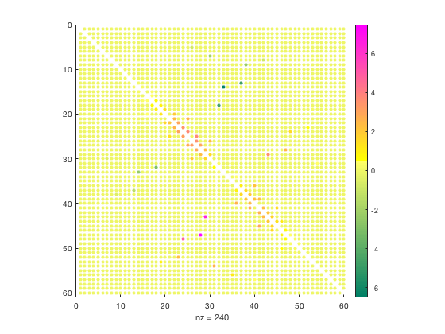

# spycolor.m: Visualize matrix sparsity with color


Author: Kelly Kearney


This repository includes the code for the `spycolor.m` Matlab function, along with all dependent functions required to run it.


This function is an extension of Matlab's spy function, which plots the sparsity pattern of a matrix.  The extension allows one to visualize the magnitude of non-missing values with color and/or size of the plotted dots.  It also has special handling for NaNs, showing them as empty black circles.


## Contents

            
- Getting started        
- Syntax        
- Example 1: Plot a sparsity pattern        
- Example 2: Plot a sparsity pattern for a matrix with NaNs        
- Example 3: Change the empty-value indicator        
- Example 4: View a 3D matrix        
- Contributions

## Getting started


**Prerequisites**


This function requires Matlab R14 or later.


**Downloading and installation**


This code can be downloaded from [Github](https://github.com/kakearney/spycolor-pkg/). **Matlab Search Path**


The following folders need to be added to your Matlab Search path (via `addpath`, `pathtool`, etc.):


```matlab
spycolor-pkg/spycolor
```


## Syntax


`spycolor(a)` plots the sparsity pattern of matrix `a`, which can be either a 2D or 3D array.  A colored dot is plotted for all non-zero values in `a`, with color corresponding to value.


`spycolor(a,emptyval)` plots the sparsity pattern where values in matrix `a` do not equal `emptyval`.


`spycolor({a,sz})` scales the colored dots to sizes in the `sz` array, where `sz` is either a scalar (default = 20) or an array the same size as `a` with non-zero, non-negative values corresponding to all elements to be plotted.


## Example 1: Plot a sparsity pattern


```matlab
b = bucky .* peaks(size(bucky,1));
spycolor(b);
colorbar;
```


## Example 2: Plot a sparsity pattern for a matrix with NaNs


```matlab
b = bucky .* peaks(size(bucky,1)) + spdiags(nan(60,1),0,60,60);
cla
spycolor(b);
colorbar;
```


## Example 3: Change the empty-value indicator


```matlab
cla;
spycolor(b, NaN);
colormap([summer; flipud(spring)]);
colorbar;
```





## Example 4: View a 3D matrix


```matlab
figure;
[x,y,z,v] = flow;
v(abs(v - -3) > 0.5) = 0;
spycolor({v, 5});
view(37.5, 30);
colorbar;
```


## Contributions


Community contributions to this package are welcome!


To report bugs, please submit [an issue](https://github.com/kakearney/spycolor-pkg/issues) on GitHub and include:


  - your operating system
  - your version of Matlab and all relevant toolboxes (type `ver` at the Matlab command line to get this info)
  - code/data to reproduce the error or buggy behavior, and the full text of any error messages received

Please also feel free to submit enhancement requests, or to send pull requests (via GitHub) for bug fixes or new features.


I do monitor the MatlabCentral FileExchange entry for any issues raised in the comments, but would prefer to track issues on GitHub.


<sub>[Published with MATLAB R2018a]("http://www.mathworks.com/products/matlab/")</sub>
